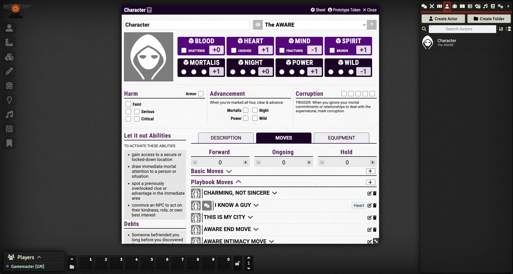

# Urban Shadows 2E (PbtA)

## An Urban Shadows 2E module for Foundry VTT using the PbtA System
This module is for [Foundry VTT](https://foundryvtt.com/) and requires the [PbtA System](https://github.com/asacolips-projects/pbta) created by [asacolips](https://github.com/asacolips).

<!--- Downloads @ Latest Badge -->

<!--- Forge Bazaar Install % Badge -->

     
     
    

     
     
     
     

     
     
     
     

[Description of the game with links to the publisher goes here.]

## Screenshot

## Dependencies

The following Foundry VTT game system must be installed to use this module: [Powered by the Apocalypse](https://foundryvtt.com/packages/pbta).

## Features

- Feature One
- Feature Two

## TODO
- TODO One

# License & Acknowledgements

Icons from game-icons.net are released under a Creative Commons Attribution 3.0 Unported license. https://creativecommons.org/licenses/by/3.0/
