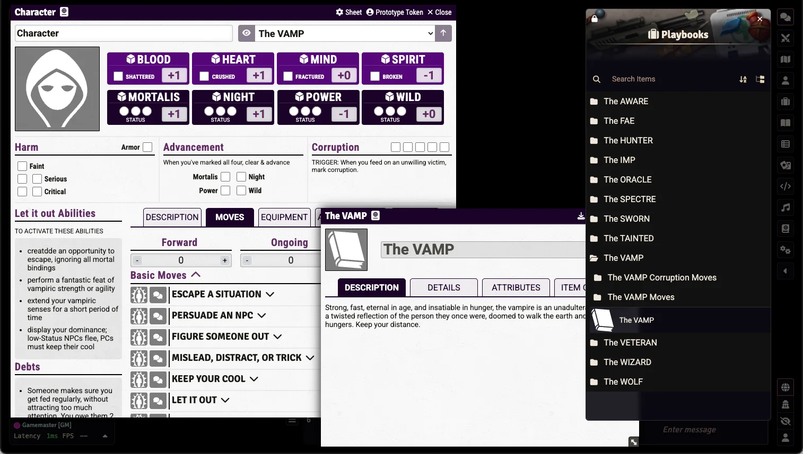

# Urban Shadows 2E (PbtA) (Unofficial)

    
     
     
    
     

     
     
     
     

   	

### An unofficial Urban Shadows 2E module for Foundry VTT using the PbtA System

[Urban Shadows 2e](https://magpiegames.com/collections/urban-shadows) is a political urban fantasy tabletop roleplaying game where players take on the roles of powerful, supernatural beings navigating the gritty struggles of modern city life. Set in a world where vampires, mages, fae, and mortals coexist in uneasy balance, the game focuses on power, corruption, and the complex web of alliances and betrayals that shape urban communities. Built on the [Powered by the Apocalypse](http://apocalypse-world.com/pbta/games/find) system, it emphasizes narrative-driven play, character growth through tough choices, and the consequences of wielding influence in a city that always demands something in return.

The ideas used in this module are from Urban Shadows 2E from Magpie Games. You can get the Book at: https://magpiegames.com/collections/urban-shadows

This module is for [Foundry VTT](https://foundryvtt.com/) and requires the [PbtA System](https://github.com/asacolips-projects/pbta) created by [asacolips](https://github.com/asacolips).

If you’ve enjoyed my work and find value in what I create, please consider supporting me with a small donation on [Ko-fi](https://ko-fi.com/G2G3I91JQ). I truly love what I do, and your support helps me dedicate time and resources to ongoing development. Every contribution, no matter the size, makes a difference and allows me to continue doing what I’m passionate about. Thank you for considering—it means the world to me.

## Screenshot

## Dependencies

The following Foundry VTT game system must be installed to use this module: [Powered by the Apocalypse](https://foundryvtt.com/packages/pbta).

## How to Install

You can install the latest released version of the module by using this manifest link in Foundry VTT. [Instructions](https://foundryvtt.com/article/tutorial/): https://github.com/philote/urban-shadows-pbta/releases/latest/download/module.json

## Features
- Sheets for 
  - Characters
  - Playbooks
  - City Hubs
  - Factions
  - Moves
  - Gear
  - NPCs
- Compendiums for free content:
  - Playbooks & Playbook Moves
  - Basic, Circle, Faction, hub, and Debt Moves
  - Gear
  - Roll tables

## TODO
- get ADVANCED MOVES working
- Improve NPC sheets
- Relationship and debt tracking on sheets
- Fix a bug with Hub Moves (they get reset when edited)

## Licensing

[Urban Shadows](https://magpiegames.com/collections/urban-shadows) was created by Andrew Medeiros and Mark Diaz Truman and is copyright 2015 by [Magpie Games](https://magpiegames.com), including all text and art. All rights are reserved.

> **Licensing Note:** This module is an independent, open-source project. Some game text from Urban Shadows 2E is currently used with verbal permission from Magpie Games while a formal fan-collaboration license is being finalized. The code is licensed under Apache 2.0, but the game content and art from Magpie Games will be subject to a separate, more restrictive license.

This module is built on top of the PbtA system for Foundry VTT.

This module uses a multi-license approach:

- **Module Code & Structure**: Licensed under [Apache License 2.0](LICENSE)
- **Third-Party Icons**: Licensed under [Creative Commons](ATTRIBUTION.md)
- **Urban Shadows 2E**: Game content © 2015-2024 [Magpie Games](https://magpiegames.com)

See [LICENSING-GUIDE.md](LICENSING-GUIDE.md) for complete details.

### Contributing

We welcome contributions! By submitting pull requests, you agree to license your contributions under Apache 2.0. Please note:
- Only contribute code and original assets
- Do not submit any copyrighted Urban Shadows content
- See [CONTRIBUTING.md](CONTRIBUTING.md) for guidelines

### Attribution

Icons used under Creative Commons licenses - see [ATTRIBUTION.md](ATTRIBUTION.md) for full credits.

"city of lights" header image by [paul bica](https://www.flickr.com/photos/dexxus/) used under CC BY 2.0.

"[New York City at night HDR](https://commons.wikimedia.org/w/index.php?curid=1150291)" (Login and World thumbnail images) by [Paulo Barcellos Jr.](https://www.flickr.com/people/paulobar) is licensed under [CC BY-SA 2.0 
</a>
](https://creativecommons.org/licenses/by-sa/2.0/?ref=openverse) .