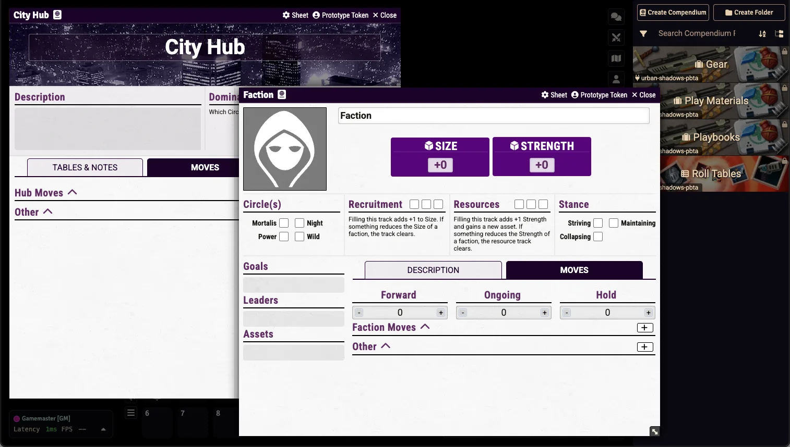
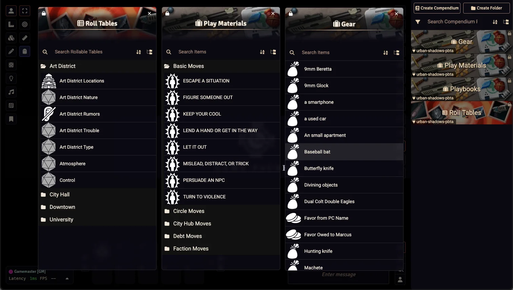

# Urban Shadows 2E (PbtA) (Unofficial)

> [!Warning]
> This module is still in development, use with caution.

    
     
     
    
     

     
     
     
     

   	

### An unofficial Urban Shadows 2E module for Foundry VTT using the PbtA System

[Urban Shadows 2e](https://magpiegames.com/collections/urban-shadows) is a political urban fantasy tabletop roleplaying game where players take on the roles of powerful, supernatural beings navigating the gritty struggles of modern city life. Set in a world where vampires, mages, fae, and mortals coexist in uneasy balance, the game focuses on power, corruption, and the complex web of alliances and betrayals that shape urban communities. Built on the [Powered by the Apocalypse](http://apocalypse-world.com/pbta/games/find) system, it emphasizes narrative-driven play, character growth through tough choices, and the consequences of wielding influence in a city that always demands something in return.

The ideas used in this module are from Urban Shadows 2E from Magpie Games. You can get the Book at: https://magpiegames.com/collections/urban-shadows

This module is for [Foundry VTT](https://foundryvtt.com/) and requires the [PbtA System](https://github.com/asacolips-projects/pbta) created by [asacolips](https://github.com/asacolips).

If you’ve enjoyed my work and find value in what I create, please consider supporting me with a small donation on [Ko-fi](https://ko-fi.com/G2G3I91JQ). I truly love what I do, and your support helps me dedicate time and resources to ongoing development. Every contribution, no matter the size, makes a difference and allows me to continue doing what I’m passionate about. Thank you for considering—it means the world to me.

## Screenshot

## Dependencies

The following Foundry VTT game system must be installed to use this module: [Powered by the Apocalypse](https://foundryvtt.com/packages/pbta).

## How to Install

You can install the latest released version of the module by using this manifest link in Foundry VTT. [Instructions](https://foundryvtt.com/article/tutorial/): https://github.com/philote/urban-shadows-pbta/releases/latest/download/module.json

## Features
- Sheets for 
  - Characters
  - Playbooks
  - City Hubs
  - Factions
  - Moves
  - Gear
  - NPCs
- Compendiums for free content:
  - Playbooks & Playbook Moves
  - Basic, Circle, Faction, hub, and Debt Moves
  - Gear
  - Roll tables

## TODO
- Compendium
    - Create the rest of the City Hub data
    - Create free City Hubs
    - Fix the Playbook Details
    - fix the Playbook auto grants
    - add images to gear
- Improve NPC sheets
- Relationship and debt tracking on sheets

# License & Acknowledgements
[Urban Shadows](https://magpiegames.com/collections/urban-shadows) was created by Andrew Medeiros and Mark Diaz Truman and is copyright 2015 by [Magpie Games](https://magpiegames.com), including all text and art. All rights are reserved.

Icons used are from game-icons.net and are released under a Creative Commons Attribution 3.0 Unported license. https://creativecommons.org/licenses/by/3.0/

Pistol gun icon
by John Colburn under CC BY 3.0
Glock icon
by Skoll under CC BY 3.0
Smartphone icon
by Delapouite under CC BY 3.0
City car icon
by Delapouite under CC BY 3.0
Modern city icon
by Delapouite under CC BY 3.0
Baseball bat icon
by Delapouite under CC BY 3.0
Butterfly knife icon
by Skoll under CC BY 3.0
Crystal ball icon
by Lorc under CC BY 3.0
Colt M1911 icon
by Skoll under CC BY 3.0
Bowie knife icon
by Lorc under CC BY 3.0
Machete icon
by Lorc under CC BY 3.0
Revolver icon
by Delapouite under CC BY 3.0
Sawed-off shotgun icon
by Delapouite under CC BY 3.0
Secret book icon
by Delapouite under CC BY 3.0
Primitive necklace icon
by Delapouite under CC BY 3.0
Egyptian urns icon
by Delapouite under CC BY 3.0
Switchblade icon
by Skoll under CC BY 3.0
Katana icon
by Delapouite under CC BY 3.0
Electric icon
by sbed under CC BY 3.0
Baton icon
by Skoll under CC BY 3.0
Walther PPK icon
by Skoll under CC BY 3.0
Gym bag icon
by Delapouite under CC BY 3.0

City Hub header image:
“<a href="https://www.flickr.com/photos/dexxus/358919966" title="city of lights">city of lights</a>” by <a href="https://www.flickr.com/photos/dexxus/">paul bica</a>, <a href="https://creativecommons.org/licenses/by/2.0/deed.en" rel="license noopener noreferrer">CC BY 2.0</a>